#### ㅡ 이번엔 모먹지? (빅데이터기반 음식점 추천 웹)


## Table of Contents

- [Teams](#Teams)
- [Introduction](#introduction)
- [Prerequisite](#prerequisite)
- [Development](#development)
  - [Testing](#testing)
  - [Commit](#commit)
  - [Role](#role)
- [Design](#design)
- [License](#license)
- [About](#about)


## Teams

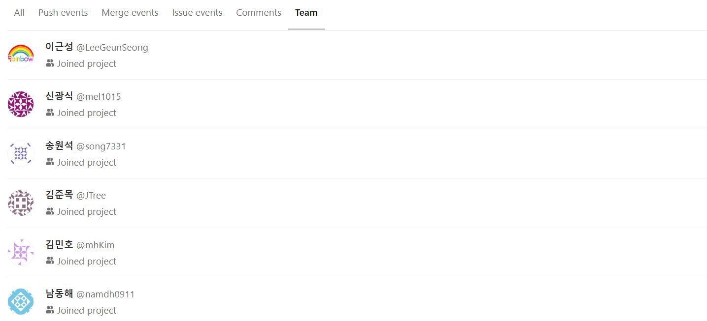

## Introduction
빅데이터인 음식점 데이터를 기반으로 여러가지 머신러닝 알고리즘을 통한 추천기능을 포함한 웹사이트 개발

```
Emo(Sub2)
|-- backend
	`-- api
		`-- manage.py
		`-- algo
			`-- ItemBased.py
			`-- Make_TFIDF_pkl_file.py
			`-- TF-IDF_Recommend_Store.py
			`-- Userbased.py
		`-- management
			`-- commands
				`-- initialize.py
				`-- __init__.py
		`-- migrations
			`-- __init__.py
		`-- __init__.py
		`-- admin.py
		`-- apps.py
		`-- models.py
		`-- ...
		
	`-- backend
        `-- __init__.py
        `-- debug.py
        `-- deploysettings.py
        `-- settings.py
        `-- urls.py
        `-- wsgi.py
	`-- requirements.txt
	
|-- frontend
	`-- src
		`-- api
		`-- assets
		`-- compoenets
		`-- plugins
		`-- router
		`-- store
		`-- utils
		`-- views
		`-- App.vue
		`-- main.js
		..

```
## Prerequisite

Must run in the Django Framework

- [django](https://www.djangoproject.com/): Develop using Django Framework!

## Development

### Commit

We are following [Angular's commitizen rules](https://github.com/angular/angular.js/blob/master/DEVELOPERS.md#-git-commit-guidelines) for formatting git commit message. This allows you to read messages that are easy to understand when looking for project history. It also uses the git commit message to generate our [CHANGELOG](/CHANGELOG.md) file.
```bash
$ npm install -g git-cz
$ git add .
$ git git-cz
$ git push
```

### Role
빅데이터 분석 알고리즘 구현

- 스키마 별로 데이터 분리
- 분석 및 전처리 후 시각화

- KNN / Matrix-factorization
  - 별점 평가 개수 10개 이상의 유저들
  - ScikitLearn Library의 surprise 사용
  - 유사한 유저들의 평점순으로 음식점 추천
- TF-IDF
  - 리뷰데이터를 각각의 store마다 모두 merge
  - Konlpy의 Library의 twitter를 이용하여 형태소분리(명사화)
  - Word Map과 Word Count Map을 이용한 TF-IDF계산
- K-Means Clustering
  - 계산한 TF-IDF를 기반으로한 ScikitLearn의 K-Means 알고리즘 이용하여 cluster 효율 계산
  - 응답 시간 및 정확도를 기반으로 40개의 Cluster로 나눔


- 만들어진 2가지 알고리즘(사용자의 평점를 기반으로한 음식점 추천, 음식점의 리뷰를 기반으로한 유사 음식점 추천)을 통한 추천 알고리즘 구현하여 Back-end에 적용시킨후에 Front의 요청에 따른 알맞는 응답이 돌아가도록 구현


## Result

- 메인페이지

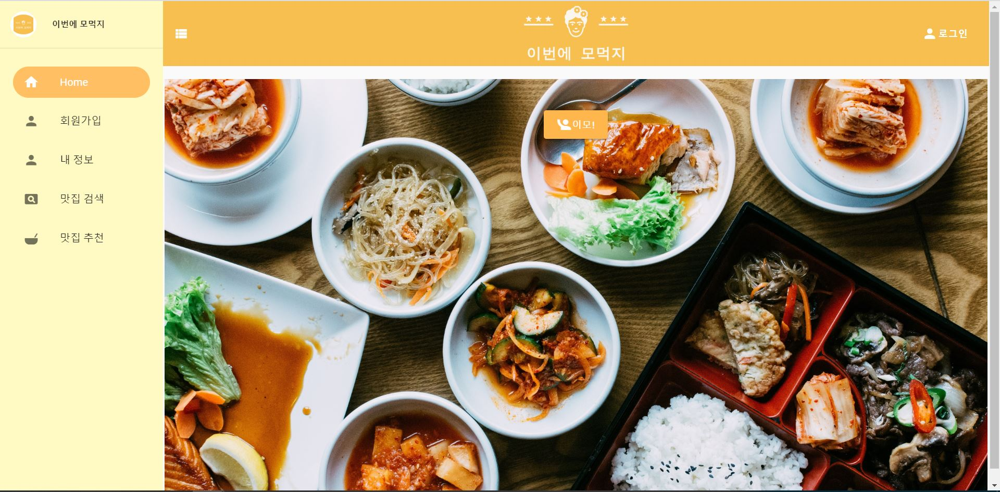

- 회원가입

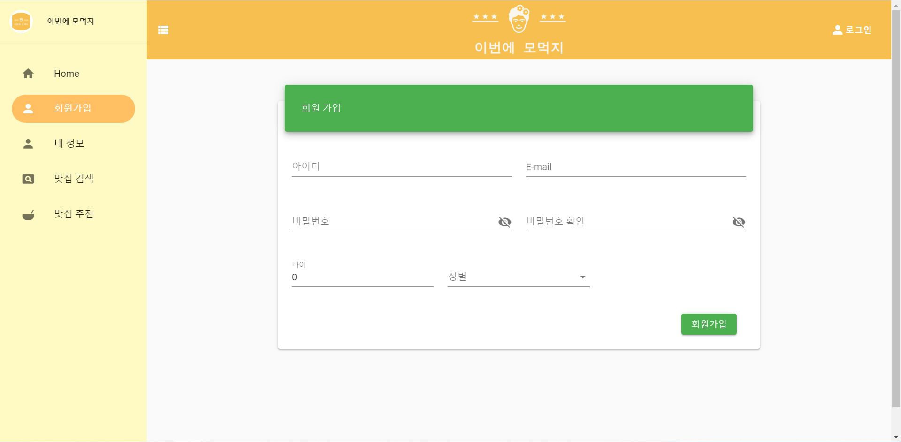

- 마이페이지

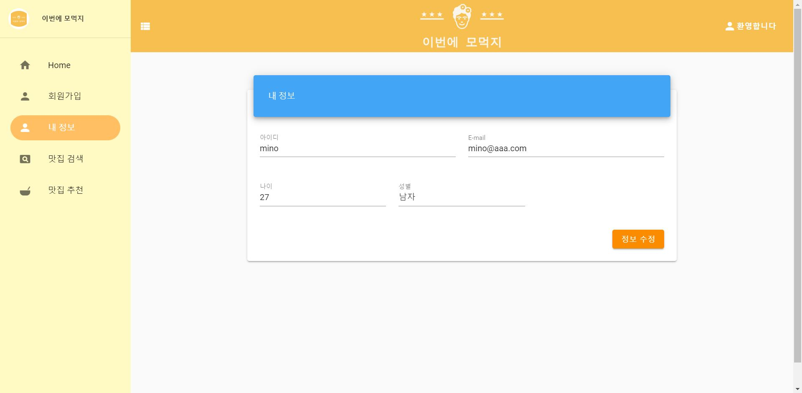

- 로그인

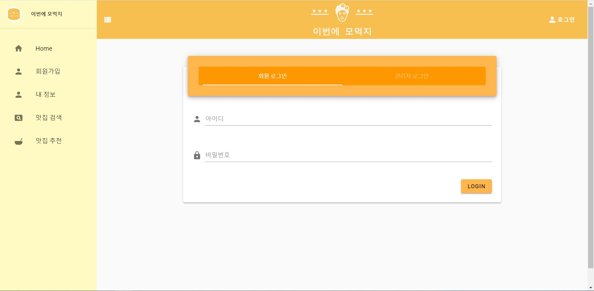

- 검색

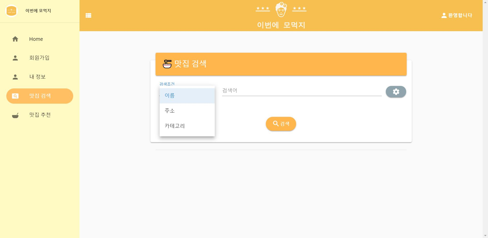

- 리뷰 개수 검색


- 검색결과

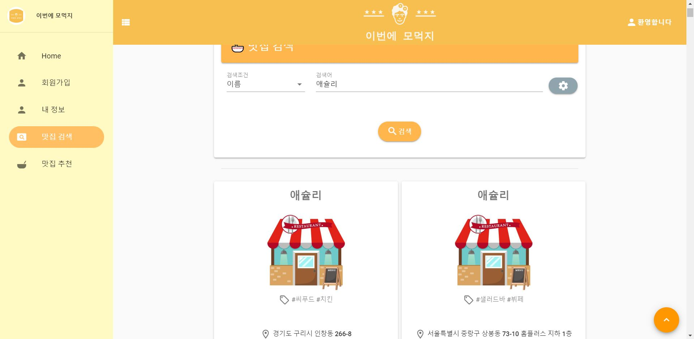

- 음식점 정보


- 리뷰페이지

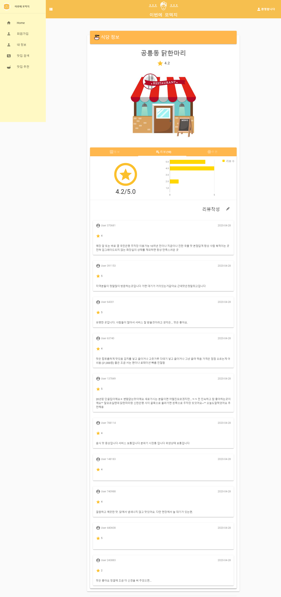

- 유사 음식점 추천


- 유저의 평점 기반 학습(리뷰개수 10개 이상) 을 통한 음식점 추천


- CI/CD

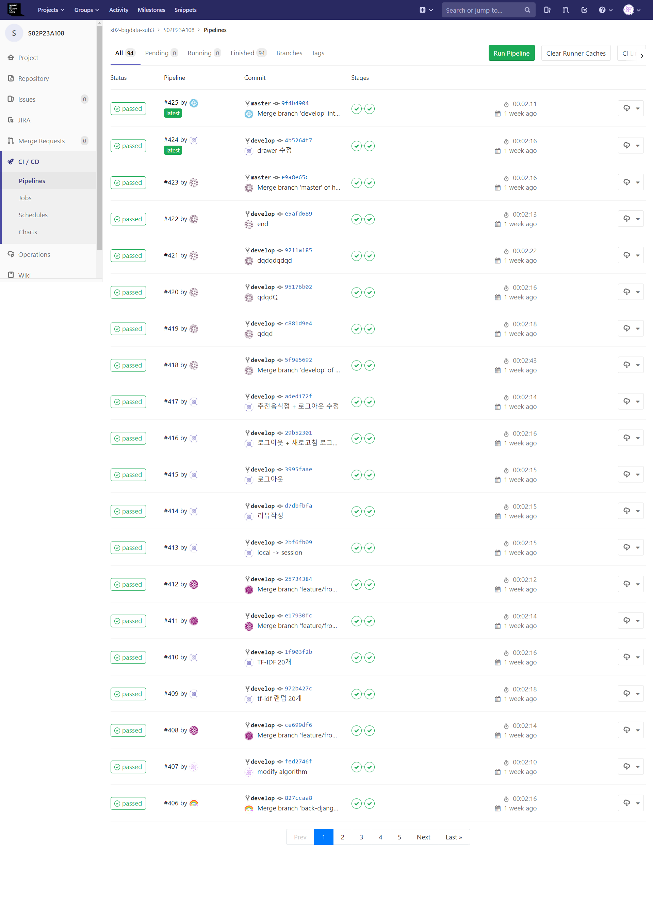

- commit 기록

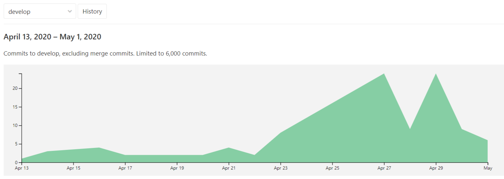

- 개발결과

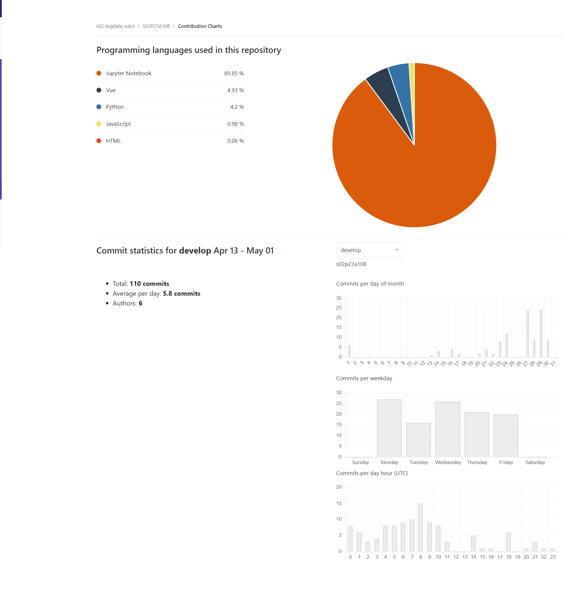

## Award

- [특화 프로젝트(빅데이터) 우수상]
- 프레젠테이션 참여

## license

MIT License

## About
Authored and maintained by **MinhoKim**